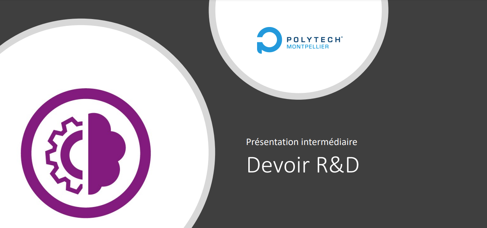

# Lien à la recherche

# Table of contents

- [Lien à la recherche](#lien--la-recherche)
  - [Les mots clés de la recherche](#les-mots-cls-de-la-recherche)
  - [État de l'art](#tat-de-lart)
  - [Sujet : défis, innovations et optimisation des tâches grâce aux logiciels définis par satellite (SDS)](#sujet--dfis-innovations-et-optimisation-des-tches-grce-aux-logiciels-dfinis-par-satellite-sds)
  

## Les mots clés de la recherche

- Software-defined satellites (SDS)
- Software-defined satellite networks (SDSN)
- Software for space
- Continuous Integration/Continuous Deployment Satellites
- DevOps in space
- SpaceOps
- Liaisons inter-satellites (Laser Links)
- Télécommunications optiques spatiales

### Quelques définitions :

**Software Defined Radio (SDR) :**

Un Software Defined Radio (SDR) est une radio où la plupart des fonctions traditionnellement réalisées par du matériel électronique sont remplacées par du logiciel. Cela permet à un seul appareil de recevoir et de transmettre de nombreuses formes d'ondes et types de signaux en changeant simplement le logiciel utilisé.

**Software Defined Network (SDN) :**

Le SDN est une technologie qui permet de contrôler et de gérer les réseaux informatiques via un logiciel centralisé. Cela sépare la gestion (le plan de contrôle) du matériel (le plan de données), rendant le réseau plus flexible et programmable.

### Les laboratoires de recherche montpelliérains

- CSU (Centre Spatial Universitaire)
- LIRMM (Laboratoire d'Informatique, de Robotique et de Microélectronique de Montpellier)
- IES (Institut d'Électronique et des Systèmes)

### Vidéos et conférences

**Youtube talks :**

Software-Defined: Will Next Generation Satellites Shape the Future of Ground Segment Infrastructure

**Conférenciers :**

Pacôme Révillon, Chief Executive Officer d'Euroconsult
Bruno Fromont, Chief Technology Officer d'Intelsat
Antonio Abad Martin, Chief Technical Officer de HISPASAT
Stuart Daughtridge, Vice President Advanced Technology de Kratos
Source : https://www.youtube.com/watch?v=llKPZk9FyHQ

## État de l'art

- Routage dans les constellations de satellites (LEO) : https://theses.fr/s372535
- Le 'network slicing' dans les réseaux 5G : intégration d'un lien satellite avec continuité de service : https://theses.fr/2022INPT0052
- Sécurisation des applications réseau dans des réseaux définis par logiciel : https://theses.fr/2018USPCB036
- Coopération au sein d'une constellation de satellites : https://theses.fr/2008ESAE0006

## Sujet : défis, innovations et optimisation des tâches grâce aux logiciels définis par satellite (SDS)

Les constellations de satellites sont de plus en plus utilisées pour fournir des services de communication, d'observation de la Terre et de navigation. Cependant, la gestion de ces constellations est complexe en raison du grand nombre de satellites et de la variété des services offerts.

Les logiciels définis par satellite (SDS) sont une approche prometteuse pour simplifier la gestion des constellations de satellites en permettant une configuration et une gestion centralisées des satellites.

- Une constellation fait en moyenne le tour de la Terre en 90 minutes (environ 16 fois par jour).
- Les satellites de la constellation doivent effectuer différentes tâches, telles que la collecte de données, la transmission de données, la surveillance de la santé du satellite, etc.
- Les satellites de constellation sont en général situés en orbite basse (LEO) entre 340 et 1325 km d'altitude.
- La société SpaceX possède à ce jour (12/12/2024) environ 6000 satellites en orbite basse, avec un objectif de 12 000 satellites "opérationnels" pour 2025.

Au cours de leur vie, les satellites sont amenés à recevoir depuis les stations terrestres (ground stations) différentes instructions : ajustement d'orbite ou désorbitation (en cas de problème), mise à jour de logiciel, changement de fréquence de communication, mais aussi à transmettre des données : rapport de mission, monitoring de la santé du cluster et des satellites qui le composent, etc.

La société SpaceX a introduit en 2024 un nouveau système de communication entre les satellites de sa constellation : les "Laser Links". Ces liaisons optiques permettent aux satellites de communiquer entre eux sans passer par les stations terrestres.
Ainsi, certains satellites au sein d'un cluster peuvent jouer le rôle de "ground station" pour les autres clusters de satellites, en cas de panne ou de problème de communication avec les stations terrestres.

Cependant, malgré la possibilité "d'élire" un satellite comme "ground station / master" pour les autres satellites du cluster, il est nécessaire de garantir la distribution des tâches et des instructions de manière équitable entre les satellites du cluster, mais aussi de garantir l'existence d'un "ground station / master" de secours en cas de panne du satellite "master".
Ainsi, la problématique de la répartition des tâches et de la redondance des "ground stations" est un enjeu majeur pour les constellations de satellites.

À partir de ces différents constats, ce sujet de thèse vise à étudier les différentes approches de répartition / optimisation des tâches des clusters de satellites : répartition dynamique des tâches entre les satellites en fonction de leur charge de travail, de leur santé et de leur position orbitale. Mais aussi la gestion d'élection dynamique des "Satellites Master" dans un cluster. Cette thèse aura pour objectif d'explorer les différentes approches de répartition des tâches et de gestion de la redondance des "ground stations" dans les constellations de satellites.